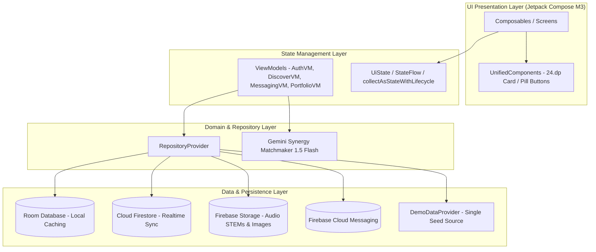

# Visual Application Architecture — MusicLinkd Layered Architecture

```mermaid
graph TD
    subgraph "UI Presentation Layer (Jetpack Compose M3)"
        Composables[Composables / Screens]
        UnifiedUI[UnifiedComponents - 24.dp Card / Pill Buttons]
    end

    subgraph "State Management Layer"
        VM[ViewModels - AuthVM, DiscoverVM, MessagingVM, PortfolioVM]
        UIState[UiState / StateFlow / collectAsStateWithLifecycle]
    end

    subgraph "Domain & Repository Layer"
        RepoProvider[RepositoryProvider]
        AI[Gemini Synergy Matchmaker 1.5 Flash]
    end

    subgraph "Data & Persistence Layer"
        Room[(Room Database - Local Caching)]
        FirebaseFirestore[(Cloud Firestore - Realtime Sync)]
        FirebaseStorage[(Firebase Storage - Audio STEMs & Images)]
        FCM[(Firebase Cloud Messaging)]
        DemoSeed[DemoDataProvider - Single Seed Source]
    end

    Composables --> UIState
    Composables --> UnifiedUI
    VM --> RepoProvider
    VM --> AI
    RepoProvider --> Room
    RepoProvider --> FirebaseFirestore
    RepoProvider --> FirebaseStorage
    RepoProvider --> FCM
    RepoProvider --> DemoSeed
```
