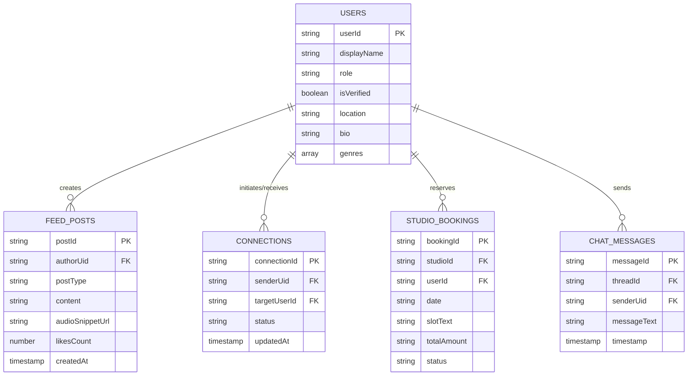

# Visual Firestore Entity Relationship Diagram — MusicLinkd

```mermaid
erDiagram
    USERS {
        string userId PK
        string displayName
        string role
        boolean isVerified
        string location
        string bio
        array genres
    }

    FEED_POSTS {
        string postId PK
        string authorUid FK
        string postType
        string content
        string audioSnippetUrl
        number likesCount
        timestamp createdAt
    }

    CONNECTIONS {
        string connectionId PK
        string senderUid FK
        string targetUserId FK
        string status
        timestamp updatedAt
    }

    STUDIO_BOOKINGS {
        string bookingId PK
        string studioId FK
        string userId FK
        string date
        string slotText
        string totalAmount
        string status
    }

    CHAT_MESSAGES {
        string messageId PK
        string threadId FK
        string senderUid FK
        string messageText
        timestamp timestamp
    }

    USERS ||--o{ FEED_POSTS : "creates"
    USERS ||--o{ CONNECTIONS : "initiates/receives"
    USERS ||--o{ STUDIO_BOOKINGS : "reserves"
    USERS ||--o{ CHAT_MESSAGES : "sends"
```
