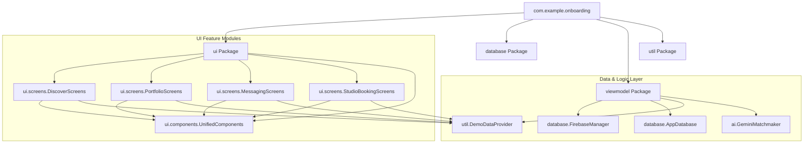

# Visual Module Dependencies — MusicLinkd Architecture

```mermaid
graph TD
    App[com.example.onboarding] --> UI[ui Package]
    App --> Database[database Package]
    App --> ViewModel[viewmodel Package]
    App --> Util[util Package]

    subgraph "UI Feature Modules"
        UI --> Discover[ui.screens.DiscoverScreens]
        UI --> Profile[ui.screens.PortfolioScreens]
        UI --> Messaging[ui.screens.MessagingScreens]
        UI --> Booking[ui.screens.StudioBookingScreens]
        UI --> Components[ui.components.UnifiedComponents]
    end

    subgraph "Data & Logic Layer"
        ViewModel --> Firebase[database.FirebaseManager]
        ViewModel --> Room[database.AppDatabase]
        ViewModel --> SeedData[util.DemoDataProvider]
        ViewModel --> Gemini[ai.GeminiMatchmaker]
    end

    Discover --> Components
    Profile --> Components
    Messaging --> Components
    Booking --> Components

    Discover --> SeedData
    Profile --> SeedData
    Messaging --> SeedData
    Booking --> SeedData
```
