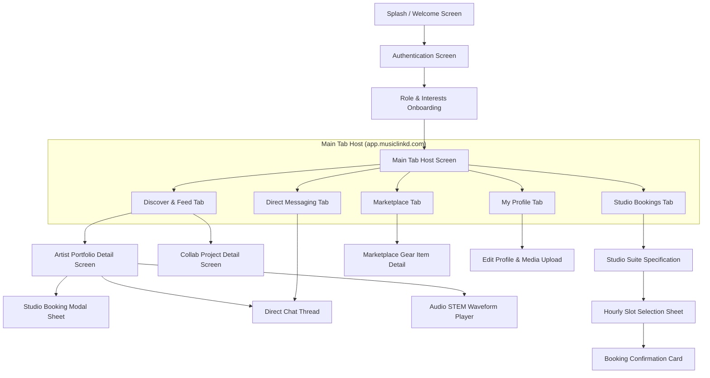

# Visual Navigation Graph — MusicLinkd Navigation Architecture

```mermaid
graph TD
    Splash[Splash / Welcome Screen] --> Auth[Authentication Screen]
    Auth --> Onboarding[Role & Interests Onboarding]
    Onboarding --> MainTab[Main Tab Host Screen]

    subgraph "Main Tab Host (app.musiclinkd.com)"
        MainTab --> DiscoverTab[Discover & Feed Tab]
        MainTab --> MessagesTab[Direct Messaging Tab]
        MainTab --> StudiosTab[Studio Bookings Tab]
        MainTab --> MarketplaceTab[Marketplace Tab]
        MainTab --> ProfileTab[My Profile Tab]
    end

    DiscoverTab --> ArtistDetail[Artist Portfolio Detail Screen]
    DiscoverTab --> ProjectDetail[Collab Project Detail Screen]

    ArtistDetail --> BookingSheet[Studio Booking Modal Sheet]
    ArtistDetail --> ChatThread[Direct Chat Thread]
    ArtistDetail --> AudioPlayer[Audio STEM Waveform Player]

    StudiosTab --> StudioDetail[Studio Suite Specification]
    StudioDetail --> SlotPicker[Hourly Slot Selection Sheet]
    SlotPicker --> BookingReceipt[Booking Confirmation Card]

    MessagesTab --> ChatThread
    MarketplaceTab --> ItemDetail[Marketplace Gear Item Detail]
    ProfileTab --> EditProfile[Edit Profile & Media Upload]
```
