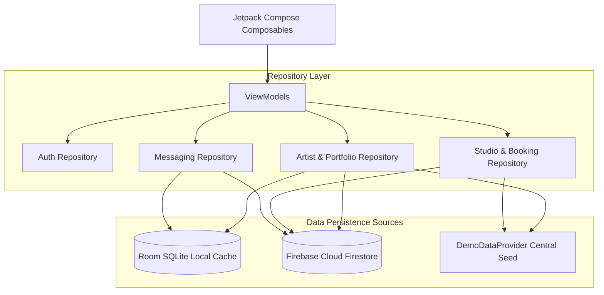

# Visual Repository Dependencies — Data Flow Architecture

```mermaid
graph TD
    UI[Jetpack Compose Composables] --> VM[ViewModels]

    subgraph "Repository Layer"
        VM --> AuthRepo[Auth Repository]
        VM --> ArtistRepo[Artist & Portfolio Repository]
        VM --> StudioRepo[Studio & Booking Repository]
        VM --> MessagingRepo[Messaging Repository]
    end

    subgraph "Data Persistence Sources"
        ArtistRepo --> RoomDB[(Room SQLite Local Cache)]
        ArtistRepo --> Firestore[(Firebase Cloud Firestore)]
        ArtistRepo --> DemoSeed[DemoDataProvider Central Seed]

        StudioRepo --> Firestore
        StudioRepo --> DemoSeed

        MessagingRepo --> RoomDB
        MessagingRepo --> Firestore
    end
```
